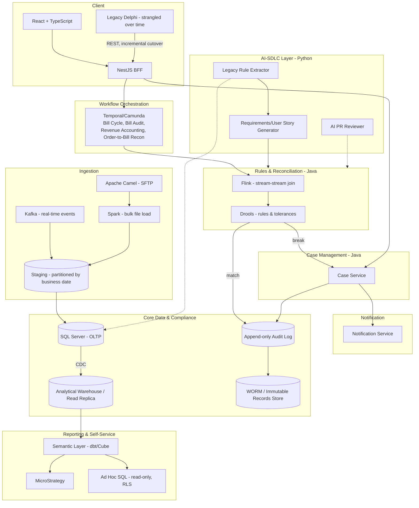

# Migration Guide: Legacy Delphi + SQL Server Revenue Assurance Platform to an AI-Enabled, Polyglot Architecture

*A revised, actionable migration playbook — consolidating architecture, tech stack, AI-SDLC enablement, compliance, and scalability requirements into phased workstreams with entry/exit criteria, owners, and risk gates.*

---

## 1. Executive Summary

This guide describes how to migrate a business-critical Revenue Assurance platform — currently a Delphi desktop client plus SQL Server stored procedures, triggers, ETL, and MicroStrategy reporting — into a modern, polyglot, AI-SDLC-enabled architecture, **without downtime and without a big-bang rewrite**.

The platform is not "just billing": it underpins **SOX compliance, revenue assurance, revenue accounting, billing, and order-to-bill reconciliation**. Every migration decision below is made with that compliance weight in mind — a rule change that would be a minor refactor in an ordinary system is a controlled, evidenced change here.

**Guiding principles**, applied throughout:

1. **Strangler Fig, not rewrite.** The legacy system keeps running throughout; new services are extracted incrementally and validated in shadow mode before cutover.
2. **Test before refactor.** Characterization tests capture the legacy system's *actual* behavior before any extraction — never assumed-correct behavior.
3. **AI assists, humans decide, artifacts prove it.** Every AI touchpoint in the lifecycle has a human checkpoint and produces a durable, auditable artifact.
4. **Compliance is architecture, not a bolt-on.** SOX controls, records retention (RIM), and data lifecycle management are designed in from Phase 0, not retrofitted before an audit.
5. **Open-source-first, licensed-where-justified.** Every tool choice is evaluated for license and production-use restrictions before being adopted.
6. **Size for real numbers.** Scalability decisions (partitioning, stream state, batch load strategy) are grounded in actual or projected throughput, not intuition.

---

## 2. Current State → Target State at a Glance

| Dimension | Current State | Target State |
|---|---|---|
| Business logic | Delphi client + SQL Server stored procedures/triggers, undocumented, untested | Java/Spring Boot domain services + Drools rules, version-controlled, tested |
| Workflows (Bill Cycle, Bill Audit, Revenue Accounting close, Order-to-Bill Recon) | Status flags/columns, cron jobs | Temporal (or Camunda) durable workflow orchestration |
| Ingestion | Kafka (real-time) + SFTP (scheduled/ad hoc), intertwined with loading logic | Kafka + Apache Camel (SFTP) + Spark (bulk load), explicit staging with business-date partitioning |
| Data movement/ETL | Custom, hand-rolled, no version control | Python + Airflow/Prefect + dbt, version-controlled, tested pipelines |
| Reporting | MicroStrategy + ad hoc SQL directly against OLTP | MicroStrategy + ad hoc SQL against a governed semantic layer over a warehouse/replica |
| Client | Delphi desktop | React + TypeScript (target), Delphi retained and strangled incrementally |
| Compliance evidence | Manual (screenshots, spreadsheets) | Automated, tamper-evident audit log + RIM-governed WORM archive |
| Records retention | Ad hoc / undocumented | Formal RIM policy: classification, retention schedule, legal hold, automated disposition |
| AI involvement | None | Rule extraction, requirements drafting, code scaffolding, PR review, drift detection — each with a human checkpoint |

---

## 3. Target Architecture (Reference Diagram)

---

## 4. Workstreams

The migration runs as **six parallel workstreams**, not a single linear sequence — this is what allows Phase durations to overlap rather than stack.

### Workstream A — Discovery & Rule Extraction
**Owner:** Engineering + Business Analysts (Revenue Accounting, Billing Ops)
**Goal:** Convert undocumented stored-procedure logic into a structured, reviewed rule inventory.

- Catalog every stored procedure, view, trigger, and ETL job; classify by risk and change frequency.
- Build the Python + LangChain extraction pipeline producing structured JSON rule entries with confidence scores.
- Business analysts review and confirm extracted rules, especially low-confidence branches.
- Build the dependency graph (which Delphi forms call which procs) to define safe extraction boundaries.

### Workstream B — Platform Foundation
**Owner:** Platform/DevOps Engineering
**Goal:** Build the safety net and tooling before any logic is touched.

- Baseline the SQL Server schema into Flyway.
- Stand up CI/CD (GitHub Actions) with per-language pipelines (Java, Python, TypeScript) and a shared OpenTelemetry observability standard.
- Write characterization tests (Testcontainers + JUnit) against real, containerized SQL Server data for every high-risk stored procedure identified in Workstream A.
- Stand up the append-only audit log and its WORM-backed archive target (Section 8) — required infrastructure, not a later add-on.

### Workstream C — Domain Extraction (Strangler Fig)
**Owner:** Domain Engineering Teams (Java/Spring Boot)
**Goal:** Incrementally move logic out of stored procedures into services, in risk order.

1. Read-only visibility — new UI reads existing data without touching the write path.
2. Rules/Inspection extraction — into Drools, validated in shadow mode against live traffic.
3. Case management extraction — once rules produce violations in the new format.
4. Workflow orchestration — Temporal/Camunda takes over Bill Cycle, Bill Audit, Revenue Accounting close, and Order-to-Bill Reconciliation sequencing, gated on SOX control-owner sign-off.

### Workstream D — Data Platform, Compliance & Scale
**Owner:** Data Engineering + Compliance/Internal Audit
**Goal:** Build the ingestion, reconciliation-at-scale, records retention, and reporting-governance capability.

- Stand up Kafka partitioning sized to real throughput (Section 7); Apache Camel + Spark for file ingestion at millions-of-rows scale.
- Stand up Flink for stream-stream reconciliation joins with bounded, business-justified tolerance windows.
- Define and implement the RIM policy: record classification, retention schedule, WORM storage, legal hold process, automated disposition (Section 8).
- Implement business-date partitioning and hot/warm/cold storage tiering.
- Stand up the semantic layer (dbt Semantic Layer/Cube) between the warehouse and MicroStrategy/ad hoc SQL access; repoint both off the OLTP primary.

### Workstream E — Client Modernization
**Owner:** Frontend Engineering
**Goal:** Replace Delphi screens incrementally, matching backend extraction order.

- Stand up the NestJS BFF and React shell.
- Rebuild a screen only once its underlying logic already lives in a Java service — never rebuild a UI in front of a stored procedure.

### Workstream F — AI-SDLC Enablement
**Owner:** Engineering, continuous across all workstreams
**Goal:** Ensure every phase of every workstream has an AI capability, a human checkpoint, and a durable artifact (Section 6).

---

## 5. Phased Timeline

| Phase | Duration (indicative) | Primary Workstreams Active | Exit Criteria |
|---|---|---|---|
| **Phase 0 — Discovery** | 2–4 weeks | A, B (start) | Rule inventory exists for all high-risk stored procedures; dependency graph complete; CI/CD skeleton running |
| **Phase 1 — Safety Net** | 2–3 weeks (overlaps Phase 0 tail) | B | Characterization tests exist for every Phase 2 extraction target; audit log + WORM archive operational |
| **Phase 2 — First Extraction** | 4–8 weeks per domain | C (rules/inspection), D (ingestion foundation) | First rule set live in Drools, validated in shadow mode with zero unexplained discrepancies; Kafka/file ingestion repointed to the new staging model |
| **Phase 3 — Case Management & Reporting Governance** | 4–6 weeks | C (case mgmt), D (semantic layer, reporting repoint) | Case service live for extracted rules; MicroStrategy/ad hoc SQL repointed to warehouse via semantic layer, read-only enforced |
| **Phase 4 — Workflow Orchestration Cutover** | 6–10 weeks | C (orchestration), D (RIM policy live) | Temporal/Camunda sequencing Bill Cycle/Bill Audit/Recon in production; SOX control-owner sign-off obtained; RIM disposition automation live |
| **Phase 5 — Scale Hardening** | 4–6 weeks | D (Flink/Spark scale tuning) | Reconciliation run meets its SLA at peak volume (Section 7); partition/tiering strategy validated under real growth |
| **Phase 6 — Client Modernization** | Ongoing, parallel | E | Delphi screens retired in the same order as backend extraction, with zero forced simultaneous cutover |

Phases 2–5 repeat per domain/bounded context (Bill Cycle, Bill Audit, Revenue Accounting, Order-to-Bill Reconciliation) — this is not a single linear pass through the whole platform, but a repeating cycle applied domain by domain.

---

## 6. AI-SDLC Integration Per Phase

| SDLC Phase | AI Capability | Human Checkpoint | Artifact |
|---|---|---|---|
| Discovery | LLM-based rule extraction from stored procedures | Business analyst confirms extracted rules, especially low-confidence ones | Structured rule inventory (JSON) |
| Requirements | AI-drafted user stories from the rule inventory | Product owner reviews/edits before backlog entry | Backlog item with acceptance criteria linked to a rule ID |
| Design | AI-suggested service/bounded-context placement | Architect confirms against the bounded-context map | ADR or PR description |
| Implementation | AI-assisted scaffolding (Copilot/Claude Code) against approved criteria | Developer reviews, edits, owns the code | Pull request linked to the backlog item |
| Testing | Characterization tests + AI-suggested edge cases | Developer/QA confirms tests pass against the legacy system first | Test suite + shadow-mode comparison report |
| Code Review | AI reviewer checks the PR against the rule inventory | Human resolves every flagged discrepancy | PR review comments + approval record |
| Deployment | AI-assisted rollback/runbook generation | Release manager approves cutover based on shadow-mode match rate | Deployment record, audit log entry |
| Monitoring | Scheduled re-extraction to detect rule drift | Business analyst confirms intentional change vs. undocumented deviation | Drift report feeding back into the rule inventory |

---

## 7. Scale Requirements (Applied Across Workstream D)

- **Kafka partitioning**: derive partition count from `max(target_throughput / per_partition_producer_rate, target_throughput / per_partition_consumer_rate)`, keyed by account/business ID for correct ordering — not guessed, not defaulted to a round number.
- **Stream-stream reconciliation state**: Flink with a bounded, business-justified time window (e.g., 72 hours) and a disk-spilling state backend (RocksDB); explicitly model "pending — not yet matchable" as distinct from "genuine break."
- **Batch file ingestion**: files (potentially millions of rows) land in object storage first, then load via parallel bulk-load (Spark) — never row-by-row through the application tier.
- **Partitioning strategy**: all high-volume tables partitioned by **business date**, not ingestion date, enabling both query pruning and clean archival-by-partition.
- **Autoscaling**: tied to backlog/queue depth/file volume (e.g., month-end billing cycles seeing 2–3x normal volume), not fixed capacity sized for the average day.

---

## 8. Compliance & Records Management (Applied Across Workstream D)

### 8.1 SOX Control Mapping

| SOX Requirement | Architecture Response |
|---|---|
| Segregation of duties | Bounded contexts with distinct services and role-based access — the person who edits a rule is not automatically the person who approves a reconciliation break |
| Tamper-evident audit trail | Append-only audit log capturing every stage transition, rule evaluation, case action, with actor/timestamp/before-after state |
| Control documentation traceable to code | The rule inventory (Workstream A) maps each control to a specific Drools rule/workflow stage in version control |
| Change management evidence | Every control-relevant change goes through a reviewed pull request — Git history is the change log |
| Consistent control execution | Workflow orchestration guarantees a control step cannot be silently skipped |

### 8.2 RIM Policy (Records & Information Management)

| Record Type | Retention | Format | Disposition |
|---|---|---|---|
| Raw source files | 7 years from business date | Object storage, WORM/object-lock | Automated, logged |
| Staged/reconciled records | 7 years from fiscal period close | Immutable snapshots or WORM object storage | Automated, legal-hold override |
| Case records | 7 years from case closure | Append-only + WORM archive | Automated, legal-hold override |
| Audit log entries | 7 years minimum (conservative default given overlapping regimes) | Append-only, WORM-backed | Disposal requires compliance sign-off |
| Derived reporting data | 13–25 months | Standard warehouse storage | Standard lifecycle rules |

A **legal hold flag** on every governed record overrides normal disposition; hold placement/release is itself an audited, access-controlled action. A single, centrally-owned disposition service — not per-table scripts — enforces the schedule, checked against the hold flag before any deletion.

### 8.3 Data Maintenance

- Storage tiering: Hot (0–90 days, SSD-backed, fully indexed) → Warm (90 days–13 months, compressed columnar) → Cold (13 months–7 years, WORM object storage) → Disposed (>7 years, no hold).
- Index/statistics maintenance and compaction scheduled outside SLA-bound processing windows.
- Data quality checks (dbt tests/Great Expectations) validate partition row counts, null rates, and key uniqueness on every load.

---

## 9. Technology Stack Summary (Open Source vs. Licensed)

| Component | Recommended | License/Notes |
|---|---|---|
| Domain services | Java 21 + Spring Boot 3 | Apache 2.0 (Spring), no restriction |
| Business rules | Drools | Apache 2.0, fully open source |
| Workflow orchestration | Temporal (self-hosted first) | MIT, free to self-host commercially; Temporal Cloud (~$100–200+/mo) once ops burden justifies it |
| Workflow orchestration (alt.) | Camunda 8 | **Free tier is non-production only as of v8.6 (Oct 2024)** — budget for Enterprise license if selected |
| Event streaming | Kafka (retained) | Apache 2.0 |
| File ingestion | Apache Camel | Apache 2.0 |
| Batch processing | Apache Spark | Apache 2.0 |
| Stream processing | Apache Flink | Apache 2.0 |
| Schema versioning | Flyway Community | Apache 2.0 |
| ETL/ELT | Airflow/Prefect Core + dbt Core | Apache 2.0 (all) |
| Semantic layer | dbt Semantic Layer / Cube Core | Apache 2.0/BSL-style OSS cores |
| Reporting | MicroStrategy (retained) | Proprietary, already licensed — repoint, don't replace |
| Observability | OpenTelemetry + Grafana + Prometheus | Apache 2.0 (OTel), AGPLv3 (Grafana OSS) |
| Client | React + TypeScript, NestJS | MIT/Apache 2.0 |
| CI/CD | GitHub Actions | Pragmatic given existing GitHub usage; Jenkins is the fully self-hosted OSS alternative |
| AI-SDLC tooling | LangChain (MIT) + Anthropic/OpenAI APIs | LLM API cost is usage-metered — budget as an operating cost |

---

## 10. Risk Register

| Risk | Likelihood | Impact | Mitigation |
|---|---|---|---|
| Undocumented rule missed during extraction | High | High (revenue/compliance impact) | Shadow-mode validation on every extraction before cutover; AI extraction confidence scoring flags ambiguous logic for manual review |
| Camunda licensing cost surprise | Medium | Medium | Licensing evaluation (Section 9) completed and budgeted before tool selection, not after |
| Reconciliation SLA missed at peak volume | Medium | High (delays financial close) | Autoscaling tied to real backlog/volume signals (Section 7); load-tested against projected peak, not average, volume |
| RIM policy disposition bug deletes retained records | Low | Severe (compliance/legal exposure) | Centralized disposition service, fail-safe on ambiguous legal-hold status, disposition actions themselves audited |
| AI-generated code merged without adequate review | Medium | Medium–High | Mandatory human checkpoint at every AI-touched SDLC phase (Section 6); AI output is never a source of truth, only a draft |
| Parallel-run (old + new) cost and complexity underestimated | Medium | Medium | Time-box shadow-mode periods per extraction; define explicit go/no-go criteria rather than running indefinitely |

---

## 11. Success Metrics

- **DORA metrics** (deployment frequency, lead time for changes, change failure rate, time to restore service) — expect lead time and change failure rate to improve first, as rule changes move from "edit a stored procedure and hope" to "edit a Drools rule in a reviewed PR."
- **Reconciliation-specific**: run completion time against SLA, break-detection latency, false-positive rate (breaks later found to be non-issues).
- **Compliance evidence completeness**: percentage of SOX-relevant controls with automated evidence (audit log entries) vs. manual (spreadsheet/screenshot) evidence — target 100% automated by Phase 4 exit.
- **Extraction coverage**: percentage of catalogued stored procedures/rules migrated to version-controlled services, tracked against the Workstream A inventory.

---

## 12. References

Validated against: Martin Fowler's Strangler Fig pattern; Michael Feathers' characterization testing (*Working Effectively with Legacy Code*); Eric Evans' bounded context (*Domain-Driven Design*); the transactional outbox/idempotent consumer patterns (microservices.io); OWASP API Security Top 10 (2023); SOX Sections 404/802 and SEC Rule 17a-4; DORA delivery-performance metrics; controlled AI-productivity studies (GitHub/Microsoft/Accenture); and current vendor licensing documentation (Temporal, Camunda). See the companion architecture documents produced earlier in this engagement for full citation detail per topic.
