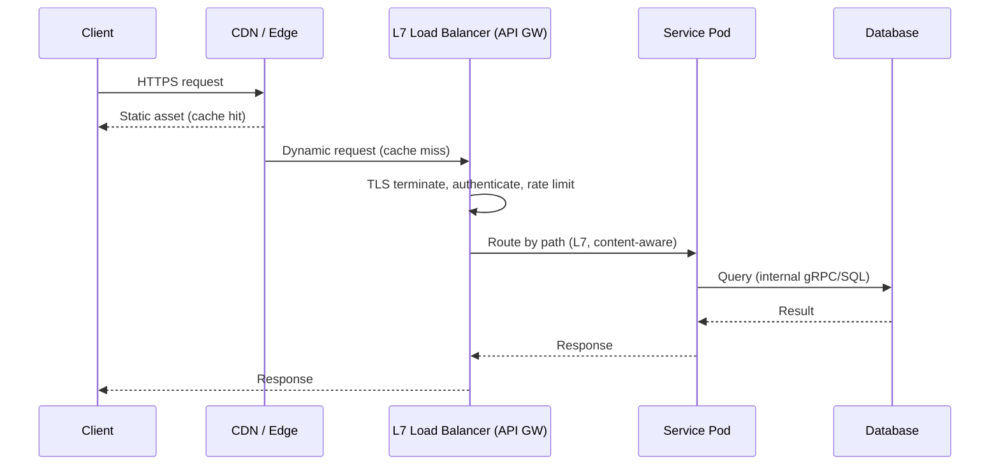

# Networking Essentials for Distributed Systems

## Problem & Context

Every distributed system is, at its core, a set of processes that must exchange data over an unreliable network. Before you can reason about caching, sharding, or consistency, you need a working model of how requests move between clients, load balancers, and services — and what happens when a link is slow, drops packets, or disappears entirely. Architects who skip this step tend to over-engineer (adding WebSockets "for real-time" when polling would do) or under-engineer (ignoring the physical latency floor imposed by geography).

## Core Concept

Networking essentials cover three layers of decisions:

1. **Transport and protocol** — how two endpoints exchange bytes (TCP vs UDP, HTTP/1.1 vs HTTP/2 vs gRPC).
2. **Connection model** — request/response vs long-lived, stateful connections (WebSockets, SSE).
3. **Traffic distribution** — how a load balancer routes requests across a fleet, and at which OSI layer it operates.

The unifying theme is a trade-off between **flexibility/observability** (HTTP, Layer 7) and **raw throughput/simplicity** (binary protocols, Layer 4).

## Production Architecture

| Component | Responsibility | Typical Technology |
|---|---|---|
| DNS / GeoDNS | Resolve client to nearest region | Route53, Cloudflare DNS |
| CDN / Edge | Serve static assets, TLS termination, DDoS absorption | CloudFront, Fastly, Cloudflare |
| L4 Load Balancer | Distribute raw TCP/UDP connections | AWS NLB, Envoy (L4 mode) |
| L7 Load Balancer / API Gateway | Route by path/header, auth, rate limiting | AWS ALB, Envoy, Kong, NGINX |
| Service Mesh (internal) | Service-to-service routing, mTLS, retries | Istio, Linkerd |
| Application Servers | Business logic | Stateless containers/pods |

Boundaries matter: the edge and L7 tier own **public-facing concerns** (TLS, auth, rate limiting); the mesh owns **internal reliability** (retries, circuit breaking); application servers own **business logic only** — they should never re-implement retry or TLS logic that the platform already provides.

## Architecture / Data Flow

**Flow:**
1. Client resolves DNS to the nearest edge region.
2. Static assets are served from CDN edge caches (no origin round trip).
3. Dynamic requests hit an L7 load balancer, which terminates TLS, authenticates, and applies rate limits.
4. The L7 tier routes based on path/header to the correct backend service.
5. Internal service-to-service calls use gRPC over HTTP/2 for lower overhead.
6. Responses flow back through the same chain; the LB tier is stateless, so any instance can serve any request.

## Concrete Example

A video-streaming platform serves manifest files (small, dynamic) and video segments (large, static) differently: segments are cached at CDN edge with a 24-hour TTL; manifests hit an L7 gateway that authenticates the session token and checks entitlement before returning a signed CDN URL. This split avoids re-authenticating every 2MB video chunk while keeping access control enforced.

## AI & Cloud Architecture

For AI workloads, the same layering applies to an **AI gateway**: it sits at L7, in front of model-serving endpoints, and adds LLM-specific concerns — token-based rate limiting, prompt/response logging for audit, and routing between model providers based on cost or latency SLOs. Streaming token responses from an LLM are functionally similar to SSE: unidirectional, long-lived, and requiring L4-aware load balancing so a client stays pinned to the pod holding its inference stream.

## Technology Choices

- **HTTP/REST** for public APIs: universal client support, cacheable, debuggable.
- **gRPC** for internal service calls: binary framing, multiplexed streams over HTTP/2, strongly typed contracts — worth the added tooling cost only when you control both ends.
- **WebSockets** only for true bidirectional needs (chat, collaborative editing); otherwise SSE or polling is simpler to operate.
- **L4 LB** for WebSocket/gRPC-heavy tiers where you need raw throughput and connection stickiness without payload inspection.

## Scalability

- **Load balancing**: L7 for content-aware routing and canary/blue-green traffic splitting; L4 when payload inspection isn't needed and every microsecond counts.
- **Connection limits**: stateful connections (WebSocket) consume a file descriptor and memory per connection on the server; plan pod capacity around max concurrent connections, not just CPU.
- **Autoscaling**: base HPA policies on connection count or queue depth for stateful services, not just CPU, since idle WebSocket connections are cheap on CPU but expensive on memory.
- **Geographic partitioning**: deploy regional stacks and route via GeoDNS when cross-continent latency (80–150ms) would violate your SLO.

## Reliability

- **Timeouts**: every hop needs an explicit timeout shorter than the caller's timeout budget (a common bug is a 30s client timeout calling a service with a 60s internal timeout — the client gives up while the server keeps working).
- **Retries**: only retry idempotent operations (GET, PUT with idempotency keys); use exponential backoff with jitter to avoid retry storms.
- **Backpressure**: when a downstream service is overloaded, the LB or gateway should shed load (429s) rather than queue indefinitely.
- **Connection draining**: on deploys, LBs must drain in-flight connections before terminating a pod, especially for long-lived WebSocket sessions — otherwise you disconnect users on every rollout.

## Security & Observability

- **TLS everywhere**, terminated at the edge and re-encrypted (or mTLS via mesh) internally for zero-trust networks.
- **AuthN/AuthZ** enforced at the L7 gateway, not duplicated inconsistently per service.
- **Observability**: propagate trace context (W3C traceparent) through every hop; without it, a slow request across five services is nearly impossible to diagnose.
- **SLIs/SLOs**: track p50/p99 latency per hop, not just end-to-end, so you can isolate which layer regressed.
- **DDoS/rate limiting**: apply at the edge, before traffic reaches compute, to protect origin capacity.

## Trade-offs

| Choice | When it wins | When it loses |
|---|---|---|
| L7 vs L4 LB | Need content routing, TLS termination | Need max throughput, minimal latency overhead |
| WebSocket vs SSE | True bidirectional, low-latency chat | Server-push only use cases — SSE is simpler |
| gRPC vs REST | Internal, high-QPS, typed contracts | Public API needing browser/curl accessibility |

## Common Pitfalls & Best Practices

- **Pitfall**: proposing WebSockets by default whenever "real-time" appears in requirements. **Fix**: default to SSE/polling; escalate only when the client must push data frequently.
- **Pitfall**: no timeout budget propagation, causing cascading slow requests. **Fix**: enforce a global deadline passed through headers.
- **Pitfall**: load testing only from one region, missing cross-continent latency. **Fix**: test from representative client geographies.

## Staff Engineer Perspective

Networking decisions are cheap to get right early and expensive to unwind later — swapping an L4 LB for L7 mid-flight means re-architecting TLS termination and auth. The judgment call is recognizing when added complexity (mesh, gRPC, multi-region) is justified by actual latency/throughput requirements versus resume-driven architecture. At 10x scale, the bottleneck is rarely the protocol choice — it's usually connection exhaustion, DNS TTL misconfiguration, or a single-region deployment hitting a physical latency wall.

## When to Use / Avoid

- **Use** L7 gateways and REST for the vast majority of public APIs.
- **Use** gRPC and service meshes once you have more than a handful of internal services with real performance needs.
- **Avoid** WebSockets unless the interaction is genuinely bidirectional and frequent.
- **Avoid** multi-region active-active until single-region capacity and cross-region consistency costs have been justified by actual traffic data.
