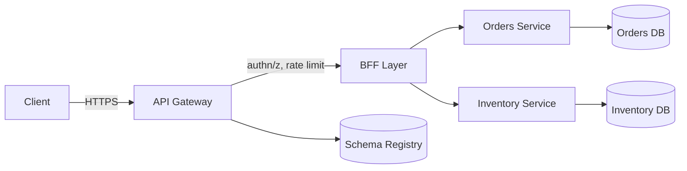

# API Design for Production Systems

## Problem & Context

An API is the contract between your system and everything that depends on it — mobile clients, partner integrations, internal services. Get the contract wrong and you either break clients on every change or accumulate compatibility debt that slows every future release. API design is a governance problem as much as a technical one.

## Core Concept

API design is choosing a **style** (REST, GraphQL, gRPC), a **resource model** (what nouns exist, what verbs act on them), and a **versioning/evolution strategy** that lets the contract change without breaking existing consumers.

## Production Architecture

| Component | Responsibility |
|---|---|
| API Gateway | AuthN, rate limiting, request validation, routing |
| Backend-for-Frontend (BFF) | Aggregate/shape responses per client type |
| Service Layer | Domain logic, owns its own resource schema |
| Schema Registry / Contract Store | OpenAPI/Protobuf definitions, breaking-change detection |
| API Docs Portal | Developer-facing documentation, generated from schema |

The gateway owns cross-cutting concerns; the BFF owns client-specific shaping (so a mobile app doesn't get a payload designed for a web dashboard); each service owns its own resource schema — no service should reach into another's database to serve an API response.

## Architecture / Data Flow

**Flow:**
1. Client calls a versioned endpoint, e.g. `POST /v2/orders`.
2. Gateway validates the JWT, checks rate limits, validates the request body against the registered schema.
3. BFF aggregates calls to Orders and Inventory services, shaping a client-specific response.
4. Each service enforces its own invariants and talks only to its own datastore.
5. Schema changes are validated against the registry for backward compatibility before deploy.

## Concrete Example

A ticketing platform exposes `POST /events/{id}/reservations`. The endpoint is idempotent via a client-supplied `Idempotency-Key` header, returns `201` with a `Location` header pointing to the new reservation, and `409` if the seat is already held. Pagination on `GET /events/{id}/reservations` uses a cursor (`next_cursor` opaque token) rather than offset, because reservations are created continuously and offset pagination would skip or duplicate rows under concurrent writes.

## AI & Cloud Architecture

LLM-backed endpoints (e.g., `POST /v1/chat/completions`) introduce new API concerns: streaming responses (chunked transfer or SSE), token-based rate limiting instead of request-count limiting, and cost attribution per API key. An **AI gateway** (e.g., LiteLLM, Portkey, or a custom Envoy filter) sits in front of multiple model providers, doing provider failover and normalizing request/response schemas so client code doesn't need to change when you switch models.

## Technology Choices

- **REST** for public, resource-oriented APIs — cacheable, universally supported.
- **GraphQL** when clients need flexible, nested queries across many resources and over-fetching/under-fetching is a real problem (e.g., mobile apps with variable network conditions).
- **gRPC** for internal, high-throughput, strongly-typed service calls.
- **JWT** for stateless user session auth; **API keys + HMAC signing** for service-to-service and partner integrations.

## Scalability

- **Rate limiting**: token-bucket per API key at the gateway; separate limits for read vs write endpoints.
- **Pagination**: cursor-based for high-write collections; offset-based acceptable for small, mostly-static datasets.
- **Caching**: `ETag`/`If-None-Match` for conditional GETs; CDN caching for public, cacheable GET endpoints.
- **Bulk endpoints**: for high-volume clients, offer batch operations (`POST /orders/batch`) to reduce per-request overhead.

## Reliability

- **Idempotency keys** on all POST endpoints that create resources — a network retry must not create duplicate orders.
- **Explicit timeouts** and circuit breakers on any API that calls downstream services synchronously.
- **Graceful degradation**: if a non-critical enrichment service (e.g., recommendations) is down, return the core response without it rather than failing the whole request.
- **Versioning**: additive changes (new optional fields) don't require a version bump; breaking changes require a new version path (`/v2/`) with a documented deprecation window for `/v1/`.

## Security & Observability

- Validate all input against a schema at the gateway — don't rely on downstream services to reject malformed payloads.
- Never leak internal error details (stack traces, DB errors) in API responses; map to generic error codes.
- Log request/response metadata (not full bodies containing PII) with correlation IDs for tracing.
- For AI endpoints: log prompts/completions separately with access controls, since they may contain sensitive user input, and implement output filtering to catch injected instructions in tool-calling flows.

## Trade-offs

| Choice | When it wins | When it loses |
|---|---|---|
| REST | Simple resource CRUD, public API, caching | Complex nested queries need many round trips |
| GraphQL | Flexible client queries, mobile bandwidth constraints | Harder to cache, N+1 query risk on backend |
| Cursor pagination | High write throughput, real-time feeds | Slightly more complex client implementation |
| Offset pagination | Simplicity, "jump to page N" UX | Breaks under concurrent inserts/deletes |

## Common Pitfalls & Best Practices

- **Pitfall**: designing APIs around database tables instead of client use cases, leaking implementation details.
- **Pitfall**: no idempotency strategy, causing duplicate charges/orders on client retries.
- **Pitfall**: unbounded result sets with no pagination, causing timeout and memory issues at scale.
- **Best practice**: publish an OpenAPI/Protobuf spec as the source of truth and generate client SDKs and docs from it, so the contract and the documentation can't drift apart.

## Staff Engineer Perspective

API design decisions compound: a poorly chosen resource model or missing idempotency key becomes a production incident months later when traffic scales up. The judgment call is how much upfront design effort a given endpoint deserves — a couple of minutes for an internal admin tool, real design review for a public partner API that hundreds of clients will integrate against. At 10x scale, the endpoints that fail first are the ones without pagination, without rate limits, or without an idempotency contract — invest disproportionately there.

## When to Use / Avoid

- **Use** REST as the default for anything public-facing or resource-shaped.
- **Use** GraphQL only when you have a real over/under-fetching problem and the team can own the added query-cost and caching complexity.
- **Avoid** exposing internal gRPC contracts directly to external clients — wrap with a REST/GraphQL BFF instead.
