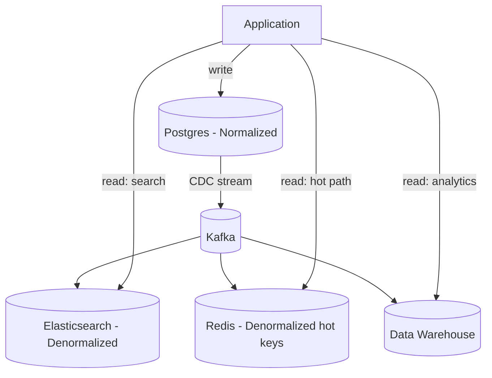

# Data Modeling for Distributed Systems

## Problem & Context

Data modeling decisions — relational vs NoSQL, normalized vs denormalized — determine what queries are fast, what operations are transactional, and how painful future schema changes will be. Unlike a caching layer you can bolt on later, a wrong data model often requires a costly migration once traffic and data volume grow.

## Core Concept

Data modeling is the process of mapping business entities and their relationships onto storage structures that match your **access patterns**, not just your conceptual entity-relationship diagram. The central trade-off is between **normalization** (single source of truth, expensive joins) and **denormalization** (duplicated data, cheap reads, expensive updates).

## Production Architecture

| Component | Responsibility |
|---|---|
| OLTP Database (Postgres/MySQL) | Transactional writes, referential integrity |
| NoSQL Store (DynamoDB/MongoDB) | High-scale, access-pattern-optimized reads/writes |
| CDC Pipeline (Debezium/Kafka Connect) | Propagate changes to derived stores |
| Read-optimized Views (Elasticsearch, materialized views) | Denormalized, query-specific projections |
| Data Warehouse (Snowflake/BigQuery) | Analytical queries, decoupled from OLTP load |

The OLTP store owns correctness and consistency; derived stores (search index, cache, warehouse) own **query performance** for specific access patterns and are allowed to be eventually consistent.

## Architecture / Data Flow

**Flow:**
1. Writes go to the normalized OLTP store, enforcing referential integrity and transactional guarantees.
2. A CDC pipeline captures row-level changes and streams them to Kafka.
3. Consumers project those changes into denormalized, query-specific stores: a search index, a cache, a warehouse.
4. Reads are routed to the store best suited to the query — hot lookups from cache, full-text from search, analytics from the warehouse — keeping load off the OLTP primary.

## Concrete Example

An e-commerce order system stores `users`, `products`, and `orders` as normalized tables in Postgres, with `orders` referencing `user_id` and `order_items` referencing `product_id`. For the order confirmation page (a hot, read-heavy path), a CDC-fed denormalized `order_summary` document in DynamoDB embeds the user's display name and each item's product title and price at time of purchase — avoiding three joins per page load and preserving historical accuracy even if the product name later changes.

## AI & Cloud Architecture

RAG (Retrieval-Augmented Generation) systems require an additional modeling layer: chunking documents into passages, embedding them into vectors, and storing them in a vector database (Pinecone, pgvector, Weaviate) alongside metadata for filtering. The access pattern here — "find semantically similar passages, filtered by tenant/date" — is fundamentally different from relational modeling and requires its own partition strategy (usually by tenant ID) to keep similarity search fast and isolated per customer.

## Technology Choices

- **Postgres/MySQL** for data with strong relationships and transactional needs (orders, payments, inventory).
- **DynamoDB/Cassandra** for access patterns known upfront, needing horizontal scale beyond a single relational instance (activity feeds, IoT telemetry).
- **MongoDB** for semi-structured, evolving schemas where relationships are shallow (content management, product catalogs with varying attributes).
- **Vector DB** for embedding-based similarity search in AI retrieval pipelines.

## Scalability

- Normalize first; denormalize specific hot paths only after measuring read latency/joins as the bottleneck.
- Use CDC rather than dual writes to keep derived stores in sync — dual writes risk partial failure and drift.
- Partition NoSQL tables by access pattern (partition key = the field most queries filter on).
- Use read replicas for analytical or reporting queries so they don't compete with OLTP write throughput.

## Reliability

- Enforce foreign key constraints in the source of truth even if derived stores relax them.
- CDC consumers must be idempotent (dedupe by offset/event ID) since at-least-once delivery is the norm.
- Schema migrations on the primary store should be backward-compatible (additive columns, expand-contract pattern) to avoid downtime.
- Denormalized copies are a liability during backfills — version them so you can detect and repair drift.

## Security & Observability

- Classify PII fields at the schema level and apply column-level encryption or tokenization where required (payment data, SSNs).
- Track replication lag between the primary and each derived store as an explicit SLI — staleness beyond a threshold should page, not silently degrade.
- Audit log any direct write to a derived/denormalized store outside the CDC pipeline — it's a common source of inconsistency.

## Trade-offs

| Choice | When it wins | When it loses |
|---|---|---|
| Normalized relational | Complex relationships, strong consistency needs | High read fan-out, join-heavy hot paths |
| Denormalized NoSQL | Known access patterns, horizontal scale | Ad hoc queries, evolving relationships |
| CDC-based sync | Decouples write and read scaling | Adds eventual consistency and pipeline ops overhead |

## Common Pitfalls & Best Practices

- **Pitfall**: denormalizing prematurely "for performance" before profiling actually shows a join bottleneck.
- **Pitfall**: choosing a DynamoDB partition key based on the entity, not the actual query pattern, leading to full-table scans later.
- **Pitfall**: dual-writing to a cache and database without CDC, causing silent drift under partial failures.
- **Best practice**: write down every access pattern before choosing a NoSQL schema — if you can't enumerate the queries, you're not ready to pick partition/sort keys.

## Staff Engineer Perspective

Data modeling is the highest-leverage, hardest-to-reverse decision in a system's lifetime — the cost of migrating a poorly chosen model at 10x scale (re-sharding, backfilling a new denormalized structure under live traffic) dwarfs the cost of getting it right initially. The judgment call is resisting both extremes: don't over-normalize a system that has three known, fixed access patterns, and don't over-denormalize a system whose query needs are still evolving.

## When to Use / Avoid

- **Use** normalized relational modeling by default for transactional, correctness-critical domains.
- **Use** NoSQL/denormalized modeling once access patterns are stable and read scale exceeds what joins on a relational store can sustain.
- **Avoid** modeling a NoSQL schema before you know your queries — you will get it wrong and pay for it in a migration.
