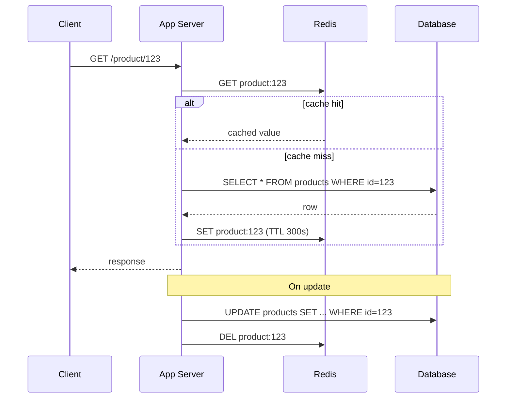

# Caching in Production Architectures

## Problem & Context

Databases are almost always the first bottleneck to appear under read-heavy load. Caching addresses this by storing frequently accessed data in fast memory, cutting read latency from tens of milliseconds to about one millisecond and shielding the database from repeated identical queries. But caching trades read performance for a new hard problem: keeping cached copies consistent with the source of truth.

## Core Concept

Caching stores a copy of data closer (in latency terms) to where it's consumed. The dominant pattern is **cache-aside**: on read, check cache first; on miss, read from the database, populate the cache with a TTL, and return. Writes go directly to the database, with the corresponding cache entry invalidated or updated.

## Production Architecture

| Component | Responsibility |
|---|---|
| CDN | Edge caching of static assets, closest to the user |
| Distributed Cache (Redis/Memcached) | Shared cache for dynamic application data |
| In-process Cache | Local, per-instance cache for small, rarely-changing data (feature flags) |
| Database | Source of truth |
| Cache Invalidation Pipeline (CDC or explicit invalidation) | Keeps cache consistent with writes |

The application owns the cache-aside logic; the cache itself owns nothing but fast key-value storage — it must never be treated as a source of truth, since it can be evicted or flushed at any time.

## Architecture / Data Flow

**Flow:**
1. Read requests check Redis first using a deterministic key (`product:123`).
2. On a hit, return immediately — no database round trip.
3. On a miss, query the database, populate the cache with a TTL, and return the result.
4. On writes, invalidate (or update) the corresponding cache key so the next read fetches fresh data.

## Concrete Example

A product catalog service caches product detail pages in Redis with a 5-minute TTL and explicit invalidation on price or inventory updates via a message published to a `product-updates` topic, consumed by all app instances to evict the local cache key. This combination — TTL as a safety net, explicit invalidation for correctness-sensitive fields — handles both the common case (data doesn't change) and the edge case (a price change must be visible quickly).

## AI & Cloud Architecture

LLM inference is expensive and latency-sensitive, making caching especially valuable: a **semantic cache** stores embeddings of previous prompts and their responses, returning a cached completion when a new prompt is semantically similar enough (cosine similarity above a threshold) rather than invoking the model again. This is distinct from exact-match caching and requires a vector index plus a similarity threshold tuned to avoid returning subtly wrong answers for prompts that only look similar.

## Technology Choices

- **Redis**: default for distributed application caching — supports TTLs, data structures beyond key-value (sorted sets for leaderboards), and pub/sub for invalidation signaling.
- **Memcached**: simpler, multi-threaded, appropriate when you need only basic key-value caching without Redis's extra data structures.
- **CDN**: for static assets and cacheable public API responses — offloads traffic before it reaches your infrastructure at all.
- **In-process (e.g., Caffeine, local dict)**: for small, low-churn data like feature flags, avoiding a network hop for every check.

## Scalability

- Scale Redis vertically first (single instance handles hundreds of thousands of ops/sec); move to Redis Cluster (sharded via consistent hashing) only once a single node's memory or throughput is the bottleneck.
- Use read replicas for Redis if read volume, not write volume, is the constraint.
- Size cache memory to your working set, not your total dataset — caching cold data wastes memory and pushes out hot keys.

## Reliability

- **Cache stampede**: when a hot key expires, many concurrent requests miss simultaneously and hammer the database. Mitigate with a mutex/lock so only one request repopulates the cache, or with early/probabilistic refresh before expiry.
- **Cache outage**: if Redis is unavailable, requests must degrade gracefully — fall back to the database directly (with a circuit breaker to avoid overwhelming it) rather than failing the request outright.
- **Stale data**: define acceptable staleness per data type explicitly; don't apply one TTL policy uniformly across unrelated data.

## Security & Observability

- Treat cached data with the same access controls as its source — don't cache a user-specific response under a key that another user's request could accidentally match.
- Monitor hit rate, eviction rate, and memory usage as core SLIs; a hit rate below ~80% on a supposedly hot dataset signals a sizing or key-design problem.
- Avoid caching secrets or PII in plaintext in a shared cache without encryption, especially if the cache is accessible from multiple services with different trust levels.

## Trade-offs

| Choice | When it wins | When it loses |
|---|---|---|
| Cache-aside | Simple, most read-heavy workloads | Requires explicit invalidation logic |
| Write-through | Strong cache/DB consistency | Adds write latency, unused entries still cached |
| TTL-only invalidation | Simplicity, tolerable staleness | Risk of serving stale data past business tolerance |
| Explicit invalidation | Freshness-critical data | More code paths, risk of missed invalidation |

## Common Pitfalls & Best Practices

- **Pitfall**: caching everything indiscriminately, adding latency and complexity to data that's rarely re-read.
- **Pitfall**: no stampede protection on a popular key, causing periodic database load spikes exactly when the cache expires.
- **Pitfall**: treating cache as durable storage — using it to hold data with no fallback if it's evicted.
- **Best practice**: profile access patterns before caching; instrument hit/miss rates from day one so cache effectiveness is visible, not assumed.

## Staff Engineer Perspective

Caching looks simple and is one of the most common sources of subtle production bugs — stale reads, stampedes, and inconsistent invalidation across services. The judgment call is deciding how much staleness a given feature can tolerate and designing the invalidation strategy around that, rather than adding a cache reflexively whenever a query is "kind of slow." At 10x scale, an under-provisioned cache is often worse than no cache: it creates a false sense of safety while thundering-herd effects periodically take down the database anyway.

## When to Use / Avoid

- **Use** caching once profiling shows the database is under real read pressure from hot, repeatedly-fetched data.
- **Use** semantic caching for LLM-backed features with high query volume and tolerance for near-duplicate matching.
- **Avoid** caching write-heavy or rarely-repeated-query data — the invalidation overhead outweighs the benefit.
