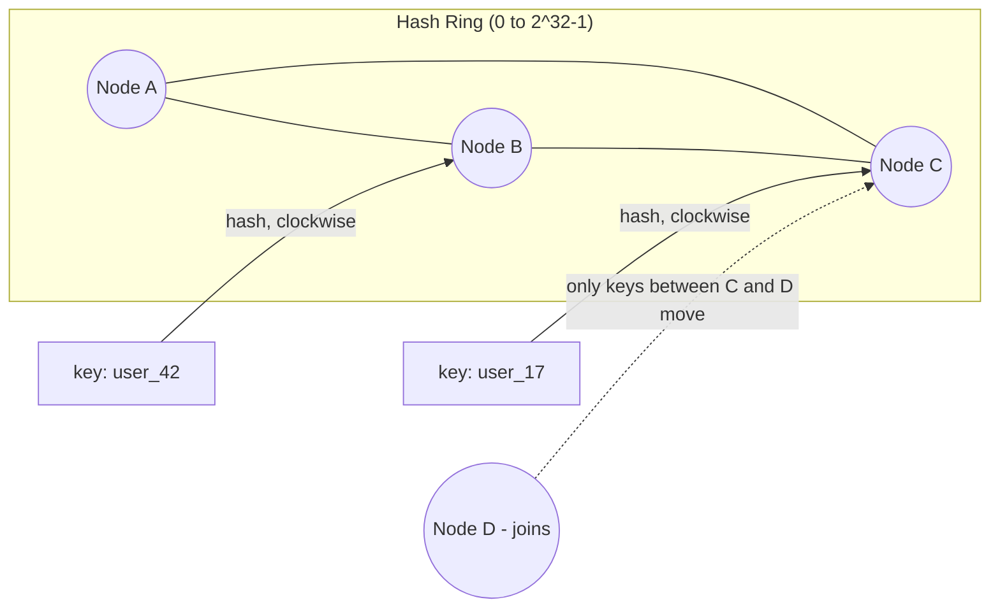

# Consistent Hashing for Distributed Systems

## Problem & Context

Distributing data across N servers with simple `hash(key) % N` works fine until N changes. Adding or removing a single server changes the modulus for every key, causing nearly all keys to remap to different servers — a disaster for a distributed cache (mass cache misses) or a sharded database (massive data movement). Consistent hashing solves this specific problem: enabling elastic scaling without a full remap.

## Core Concept

Consistent hashing places both servers and keys on a conceptual ring using a hash function. Each key belongs to the first server encountered moving clockwise from the key's position. Adding or removing a server only affects the keys between it and its neighbor on the ring — everything else stays put. Virtual nodes (multiple ring positions per physical server) smooth out uneven distribution.

## Production Architecture

| Component | Responsibility |
|---|---|
| Hash Ring | Logical structure mapping hash space to servers |
| Virtual Node Mapping | Multiple ring positions per physical node for even load |
| Client/Router Library | Computes which node owns a given key |
| Membership/Gossip Service | Propagates node join/leave events to update the ring |

The ring computation can live client-side (as in many Memcached client libraries) or in a central coordinator (as in Cassandra/DynamoDB's internal ring); either way, all participants must agree on ring state to avoid routing keys inconsistently.

## Architecture / Data Flow

**Flow:**
1. Each server is hashed onto multiple points on the ring (virtual nodes) for even distribution.
2. A key is hashed to a ring position; it's owned by the next server clockwise.
3. When a new server joins, it takes ownership of a contiguous range of keys from its clockwise neighbor — only those keys need to move.
4. When a server leaves, its keys are absorbed by the next server clockwise — again, a small, bounded fraction of total keys.

## Concrete Example

A Memcached-based session cache with 10 nodes uses consistent hashing via the client library (e.g., Ketama). When a node is added during a traffic spike, only about 1/11th of keys remap to the new node; the other ~91% of cached sessions remain valid on their existing node, avoiding a cache-wide stampede that a naive modulo scheme would cause.

## AI & Cloud Architecture

DynamoDB and Cassandra use consistent hashing internally to distribute partitions across storage nodes, which is why adding capacity to these managed services doesn't require a manual resharding project. In an AI serving context, consistent hashing is also used to route inference requests to specific GPU-hosting pods when maintaining session affinity for stateful, multi-turn conversations improves cache locality (e.g., KV-cache reuse in LLM serving), reducing redundant prefill computation.

## Technology Choices

- **Client-side consistent hashing (Ketama-style)**: appropriate for simple distributed cache clusters like Memcached, where you control the client library.
- **Built-in ring management (Cassandra, DynamoDB, Riak)**: preferred when using a database that already implements this internally — no need to reimplement.
- **Envoy/HAProxy consistent-hash load balancing**: for routing requests to backend pods with session or cache affinity, without a full sticky-session mechanism.

## Scalability

- Virtual nodes (typically 100-200 per physical node) are essential — without them, ring placement can be uneven and some nodes take disproportionate load.
- Adding capacity incrementally (one node at a time) keeps each rebalancing event small and low-risk.
- For very large clusters, monitor ring balance explicitly; skewed hash functions or too few virtual nodes can still create hot spots despite using consistent hashing.

## Reliability

- During a rebalance (node join/leave), reads for keys in transition may temporarily miss on both old and new owners — clients should fall back to the source of truth (database) rather than treat a cache miss as an error.
- Ring membership changes must be gossiped or coordinated reliably; a split-brain view of the ring (different clients seeing different membership) causes routing inconsistency and duplicate or lost writes.
- Replication is typically layered on top of consistent hashing (e.g., "store this key on the next 3 nodes clockwise") to tolerate node failure without data loss.

## Security & Observability

- Ring membership changes should be authenticated — an unauthorized node joining the ring in a cache cluster could intercept traffic for a range of keys.
- Monitor per-node load distribution as an explicit metric; a node consistently overloaded suggests insufficient virtual nodes or a skewed key distribution.
- Log ring topology changes (joins/leaves) for postmortem analysis when performance regressions correlate with rebalancing events.

## Trade-offs

| Choice | When it wins | When it loses |
|---|---|---|
| Consistent hashing | Elastic scaling, frequent node changes | Slight added complexity vs. simple modulo |
| Simple modulo hashing | Fixed, rarely-changing cluster size | Any resize causes near-total remapping |
| Directory-based mapping | Maximum control over placement | Central lookup adds latency and a dependency |

## Common Pitfalls & Best Practices

- **Pitfall**: using too few virtual nodes, resulting in uneven load distribution despite "using consistent hashing."
- **Pitfall**: assuming zero data movement on node changes — some movement is expected and normal, just bounded rather than total.
- **Pitfall**: inconsistent ring views across clients due to a membership propagation bug, causing routing errors.
- **Best practice**: rely on a battle-tested implementation (client library or the database's built-in ring) rather than hand-rolling ring logic.

## Staff Engineer Perspective

Consistent hashing is rarely something you implement from scratch in production — the value as a staff engineer is recognizing when it's the right underlying mechanism (elastic caches, sharded databases, load balancer affinity) and choosing tooling that already implements it correctly. Interviewers and architecture reviews mostly need to hear "we'll use consistent hashing so adding/removing nodes doesn't require a full remap" — deep ring-algorithm details rarely change the design decision. At 10x scale, this becomes load-bearing infrastructure: get virtual node counts and monitoring right before you're relying on it during an incident.

## When to Use / Avoid

- **Use** consistent hashing (via existing implementations) for any distributed cache or sharded store expected to scale elastically.
- **Use** it for load balancer affinity when cache locality or session stickiness matters.
- **Avoid** hand-rolling a ring implementation when a mature client library or database already provides one — the edge cases (virtual nodes, rebalancing, replication) are easy to get subtly wrong.
