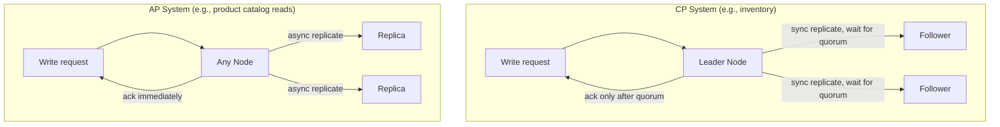

# CAP Theorem and Consistency Trade-offs in Practice

## Problem & Context

Every distributed system must decide what happens when a network partition separates nodes that would normally coordinate. Do you keep serving requests with potentially stale or conflicting data, or do you refuse requests until the nodes can agree? CAP theorem names this trade-off explicitly, and getting it wrong — assuming strong consistency where you actually have eventual consistency, or vice versa — is a common source of subtle data-correctness bugs.

## Core Concept

CAP theorem states a distributed system can only guarantee two of three properties simultaneously: **Consistency** (all nodes return the same data for the same request), **Availability** (every request receives a response), and **Partition tolerance** (the system continues operating despite network failures between nodes). Because network partitions are unavoidable at scale, the real choice is between consistency and availability during a partition. PACELC extends this: even absent a partition, you trade latency for consistency, since strong consistency requires coordination between nodes.

## Production Architecture

| Component | Responsibility |
|---|---|
| Consensus Layer (Raft/Paxos) | Coordinates strongly consistent writes across replicas |
| Leader/Follower Replication | One node accepts writes, others replicate asynchronously (AP-leaning) or synchronously (CP-leaning) |
| Quorum Configuration | Read/write quorum sizes tune the consistency/availability trade-off per operation |
| Conflict Resolution (CRDTs, last-write-wins, vector clocks) | Reconciles divergent replicas after a partition heals |

Different subsystems within one application can — and often should — make different CAP choices: an inventory service prioritizes consistency, a recommendations service prioritizes availability.

## Architecture / Data Flow

**Flow (CP path):** a write to the leader blocks until a quorum of followers acknowledges it; if a partition prevents reaching quorum, the write fails rather than risk inconsistency.

**Flow (AP path):** a write is acknowledged immediately and replicated asynchronously; if a partition occurs, both sides keep accepting writes, and conflicts are reconciled once the partition heals.

## Concrete Example

A ticketing platform uses a CP-configured relational database with row-level locking for seat reservations — if a partition occurs, the affected partition refuses new reservations for those seats rather than risk double-booking. The same platform uses an AP-configured DynamoDB table for event descriptions and marketing copy — if a partition occurs, users may briefly see slightly stale copy, which is an acceptable trade-off for uninterrupted browsing.

## AI & Cloud Architecture

Vector databases used for RAG typically favor availability and eventual consistency: a newly ingested document may take seconds to become searchable, which is acceptable for most retrieval use cases. Conversely, an AI system tracking usage-based billing or rate limit quotas needs strong consistency — an eventually-consistent quota counter can allow a client to exceed a hard spending cap before the count converges, which is a real financial risk in LLM API cost control.

## Technology Choices

- **Strongly consistent stores (Spanner, CockroachDB, Postgres with synchronous replication)**: for financial transactions, inventory, and booking systems where stale reads cause real business harm.
- **Eventually consistent stores (DynamoDB default mode, Cassandra with tunable consistency, most caches)**: for feeds, recommendations, product catalogs, and other read-heavy, staleness-tolerant workloads.
- **Tunable consistency (Cassandra quorum reads/writes, DynamoDB strongly/eventually consistent reads)**: lets you choose per-operation, which is often the pragmatic middle ground.

## Scalability

- AP systems scale reads and writes more easily since any replica can serve a request without cross-node coordination.
- CP systems bottleneck on the coordination overhead of achieving quorum, which grows with replica count and geographic spread.
- Multi-region deployments amplify this trade-off sharply: cross-region synchronous replication for strong consistency adds tens to hundreds of milliseconds of latency per write.

## Reliability

- Design explicit behavior for partition scenarios: does the system refuse writes (CP) or accept them and reconcile later (AP)? Undefined behavior here becomes an incident.
- For AP systems, define a conflict resolution strategy upfront — last-write-wins is simple but can silently drop updates; CRDTs preserve more information but add implementation complexity.
- Test partition scenarios explicitly (chaos engineering, network partition injection) rather than assuming the CAP trade-off only matters in theory.

## Security & Observability

- Track replication lag as an explicit SLI for any eventually consistent system — "how stale can this get" should have a defined and monitored bound.
- For CP systems, monitor quorum failure rate; a rising rate signals network issues that will soon manifest as write failures/unavailability.
- Audit which parts of the system claim which consistency model — a common security/correctness gap is an eventually consistent permission check that allows a brief window of unauthorized access after a permission is revoked.

## Trade-offs

| Choice | When it wins | When it loses |
|---|---|---|
| CP (consistency-first) | Money, inventory, bookings, permissions | Reduced availability during partitions, higher write latency |
| AP (availability-first) | Feeds, catalogs, recommendations, analytics | Temporary inconsistency, needs conflict resolution |

## Common Pitfalls & Best Practices

- **Pitfall**: applying one consistency model uniformly across an entire application instead of choosing per subsystem based on actual business impact of staleness.
- **Pitfall**: assuming "eventual consistency" with no bound on "eventual," leading to user-visible staleness with no monitoring or SLA.
- **Pitfall**: treating CAP as only relevant during rare network partitions and ignoring the everyday consistency/latency trade-off described by PACELC.
- **Best practice**: state explicitly, per data type, which consistency model applies and why — this becomes documentation for every future engineer touching that subsystem.

## Staff Engineer Perspective

CAP theorem is often cited as trivia but the real skill is applying it selectively across a system's subsystems rather than picking one model globally. The judgment call is quantifying the actual business cost of staleness for each data type — a two-second-stale like count is free; a two-second-stale inventory count can mean overselling. At 10x scale, the systems that hold up are the ones where this decision was made deliberately per subsystem, not inherited by default from whatever database was chosen first.

## When to Use / Avoid

- **Use** CP guarantees for money movement, inventory decrements, and resource booking where overselling or double-spending is unacceptable.
- **Use** AP guarantees for the majority of read-heavy, user-facing content where brief staleness is invisible or harmless.
- **Avoid** defaulting to strong consistency everywhere — it adds latency and reduces availability for data where nobody actually needs it.
