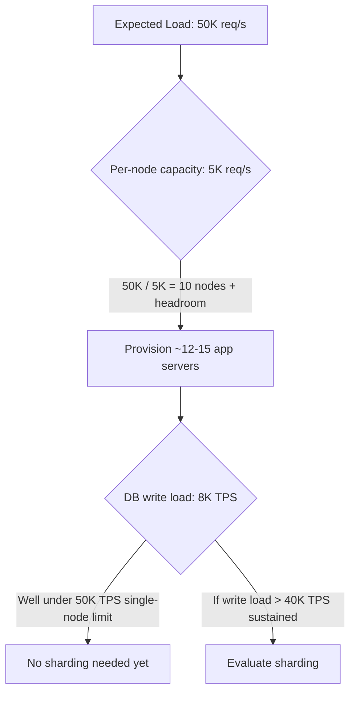

# Capacity Planning: The Numbers Every Architect Should Know

## Problem & Context

Architectural decisions — whether to shard, whether to cache, how many application servers to provision — are ultimately capacity decisions. Without rough, defensible numbers for latency, throughput, and storage limits, architects either over-engineer against imagined bottlenecks or under-provision until a production incident reveals the real ones. Modern hardware is also far more capable than intuition built on older systems suggests, which skews decisions toward premature complexity.

## Core Concept

Capacity planning is the discipline of doing back-of-the-envelope math — expected load, per-unit capacity, required headroom — at the point a design decision actually depends on it, rather than reciting memorized numbers upfront. The goal is directional correctness (are we off by 10x, not by 10%) to justify or rule out an architectural choice.

## Production Architecture

| Layer | What to measure | Typical Capacity (single well-tuned node) |
|---|---|---|
| Application servers | Requests/sec, concurrent connections | ~5-10K req/s per instance (I/O-bound), 100K+ concurrent connections |
| Cache (Redis) | Ops/sec, memory | 100K-500K ops/sec, up to ~1TB memory-bound |
| Relational DB | Transactions/sec, storage | Up to ~50K TPS, multi-TB storage comfortably |
| Message queue | Messages/sec, storage | Up to ~1M msgs/sec per broker (Kafka), tens of TB retained |
| Object storage | Throughput, durability | Effectively unlimited storage, GB/s throughput per prefix |

These numbers set the baseline against which a specific design's expected load is compared — if expected load is well under single-node capacity, added scaling complexity (sharding, multi-region) is very likely premature.

## Architecture / Data Flow

**Flow:**
1. Estimate expected load from product requirements (daily active users × actions/user, or a stated peak QPS).
2. Divide by known per-node capacity for the relevant tier (app server, database, cache) to get a raw node count.
3. Add headroom (typically 30-50%) for traffic spikes and failure tolerance (N+1 or N+2 redundancy).
4. Compare the resulting load per component against known scale-trigger thresholds (e.g., >10K sustained write TPS) to decide whether more advanced techniques (sharding, multi-region) are justified now or can be deferred.

## Concrete Example

A notification service expects to send 20M notifications/day, averaging to ~230/sec but peaking at 10x during a major event, so ~2,300/sec at peak. A single Kafka broker handling up to 1M msgs/sec is nowhere near the bottleneck; the actual constraint is downstream push notification provider rate limits (often a few thousand/sec per API key), which drives the design toward a queue-and-worker-pool pattern with backpressure, not toward scaling the message broker itself.

## AI & Cloud Architecture

LLM inference capacity planning uses different units: tokens/sec per GPU, not requests/sec, since request cost varies enormously with prompt and completion length. A single A100/H100 GPU serving a 7B-13B parameter model might sustain a few thousand tokens/sec depending on batching; a 70B+ model drops this substantially. This changes the capacity question from "how many app servers" to "how many GPU-hours, and can request batching or a smaller distilled model reduce cost per token" — a fundamentally different bottleneck than traditional CRUD capacity planning.

## Technology Choices

- Use **cloud provider published benchmarks** (RDS/Aurora sizing guides, ElastiCache sizing docs) as a starting point rather than generic industry numbers, since managed service overhead differs from raw hardware.
- Use **load testing tools** (k6, Locust, Gatling) to validate assumed per-node capacity against your actual application code, not just infrastructure defaults.
- Use **autoscaling** (HPA in Kubernetes, ASGs in EC2) to handle the gap between average and peak load rather than statically provisioning for peak at all times.

## Scalability

- Provision for **peak**, not average, load — the ratio between the two (often 5-10x for consumer apps around events/launches) is itself a number worth knowing per product.
- Prefer **horizontal scaling of stateless tiers** (app servers) since it's linear and simple; reserve vertical scaling or sharding for stateful tiers where horizontal scaling is harder.
- Revisit capacity assumptions after major traffic pattern changes (a marketing campaign, a new feature going viral) — static capacity plans age quickly.

## Reliability

- Always provision N+1 (or N+2 for critical tiers) beyond the calculated minimum to tolerate node failure without capacity loss.
- Load test failure scenarios explicitly: what happens to per-node load when one of ten nodes goes down mid-peak?
- Build alerting on leading indicators (CPU > 70%, queue depth rising) rather than only on hard failures, so capacity issues are caught before they become outages.

## Security & Observability

- Capacity numbers are only useful if backed by real telemetry — instrument request rate, latency percentiles, and resource utilization from day one.
- Track cost per request/token alongside capacity, especially for AI workloads, since GPU capacity and cost scale together in a way CPU capacity for CRUD workloads doesn't.
- Set SLO-based alerts (p99 latency, error rate) rather than only infrastructure-metric alerts, since infrastructure can look healthy while user experience degrades.

## Trade-offs

| Choice | When it wins | When it loses |
|---|---|---|
| Provision for measured peak + headroom | Predictable, product-driven traffic | Highly spiky, unpredictable traffic (flash sales) |
| Aggressive autoscaling | Variable, bursty traffic | Cold-start-sensitive workloads (databases, stateful services) |
| Over-provision statically | Simplicity, predictable cost | Wastes spend during low-traffic periods |

## Common Pitfalls & Best Practices

- **Pitfall**: using outdated per-node capacity assumptions (2010-era numbers), leading to premature sharding or caching decisions.
- **Pitfall**: capacity planning only for average load, then failing during predictable peaks (product launches, holidays).
- **Pitfall**: no load testing before launch, discovering real per-node capacity only in production.
- **Best practice**: do the math explicitly and show the work ("50K req/s ÷ 5K/instance = 10 instances + 30% headroom = 13") as part of any scaling decision, so it can be revisited when assumptions change.

## Staff Engineer Perspective

Capacity numbers are a tool for calibrating architectural judgment, not a checklist to memorize. The highest-value skill is recognizing when a proposed complexity (sharding, multi-region, a new caching tier) is justified by actual measured or projected load versus when it's solving a problem that doesn't yet exist. At 10x scale, the teams that scale smoothly are the ones that treated capacity planning as an ongoing practice — revisited after every major traffic shift — rather than a one-time exercise done at initial design time.

## When to Use / Avoid

- **Use** explicit capacity math before any decision to shard, add a caching tier, or move to multi-region.
- **Use** load testing to validate assumptions before they're load-bearing in production.
- **Avoid** designing for hypothetical future scale that isn't supported by actual growth projections — it adds cost and complexity for load that may never materialize.
